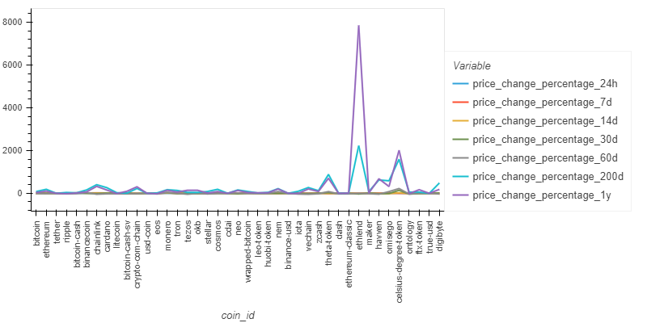
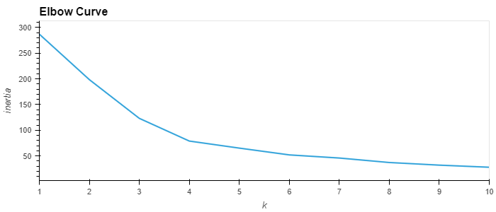
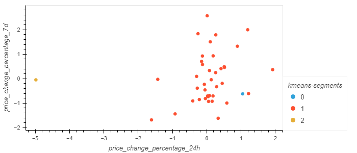
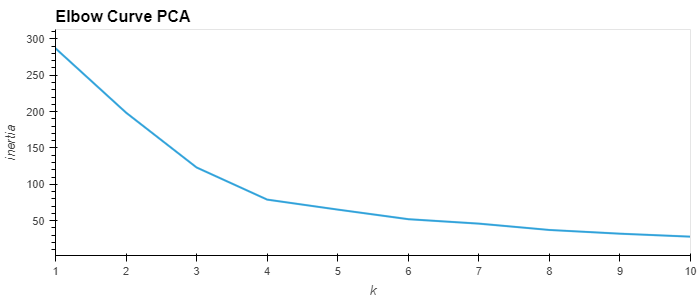
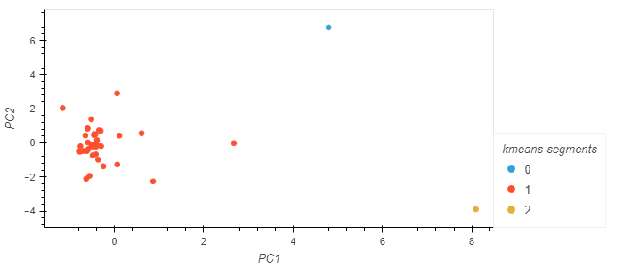
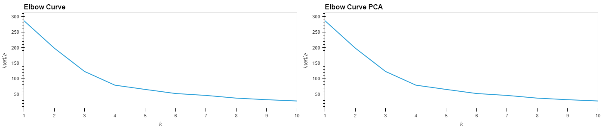
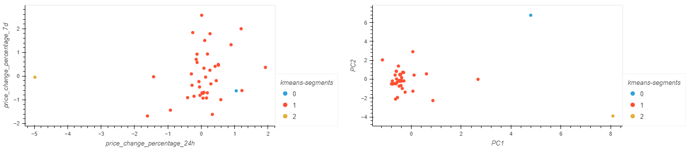

### Background

In this project, an advisor within a top-tier financial advisory firm proposes a cutting-edge method for constructing investment portfolios centered around cryptocurrencies. Unlike traditional approaches focused solely on returns and volatility, the proposed method integrates additional factors that could influence the crypto market, potentially leading to superior portfolio performance.

### What the Project Does

This project involves the development of a Jupyter notebook that applies clustering techniques to group cryptocurrencies based on their performance across various time periods. This approach provides a comprehensive view of how different cryptocurrencies behave, enabling more informed investment decisions. Leveraging both financial Python programming expertise and newfound knowledge in unsupervised learning, the notebook crafts an innovative solution.

### Project Overview

The key steps of the project are as follows:

1. **Data Import and Preparation**: Import the provided cryptocurrency price change data and prepare it for analysis.

2. **Determining the Optimal Number of Clusters**: Employ the elbow method to find the best number of clusters (k) for the original data. Visualize the results to identify the optimal value for k.

3. **Clustering with K-Means**: Utilize the K-Means algorithm to cluster the cryptocurrencies based on the original data. Evaluate the resulting clusters and visualize them using scatter plots.

4. **Optimizing Clusters with PCA**: Apply Principal Component Analysis (PCA) to reduce the dimensionality of the data. Determine the explained variance of the principal components and create a new DataFrame with the PCA-transformed data.

5. **Finding the Best k with PCA**: Repeat the process of determining the optimal number of clusters (k) using the PCA-transformed data. Compare the results with those obtained from the original data.

6. **Clustering with K-Means Using PCA**: Cluster the cryptocurrencies using K-Means on the PCA-transformed data. Visualize the resulting clusters and compare them with the original data clusters.

7. **Visualizing and Comparing Results**: Create composite plots to contrast the elbow curves and cryptocurrency clusters derived from both the original and PCA-transformed data. Analyze the impact of using fewer features on the clustering outcomes.

### Conclusion

Through this project, valuable insights into the world of cryptocurrency investments are provided, showcasing the integration of advanced machine learning techniques with financial analysis. The innovative approach promises to offer a competitive edge in an increasingly challenging financial landscape.

### Graphs
# Plot your data to see what's in your DataFrame

# Elbow Curve Normal model

# Cluster Normal model

# Elbow Curve PCA model

# PCA Cluster Plot

# Comparison of Elbow Curve

# Comparison of Clusters

